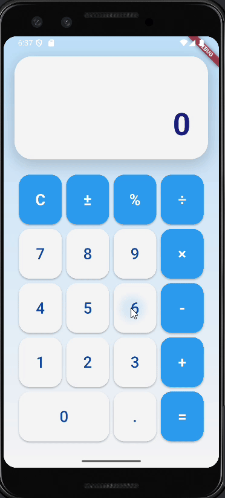

# calculadoraft

Aplicación de calculadora básica desarrollada con Flutter y destinada a ejecutarse en dispositivos Android. Realiza operaciones aritméticas simples (suma, resta, multiplicación, división) mediante una interfaz sencilla construida con componentes de Flutter y Material Design.

## Índice
- [Descripción](#descripción)
- [Instalación y ejecución](#instalación-y-ejecución)
- [Estructura del proyecto](#estructura-del-proyecto)
- [Capturas de pantalla](#capturas-de-pantalla)
- [Créditos](#créditos)

## Descripción
Este proyecto implementa una calculadora básica usando Flutter. La interfaz está construida con widgets de Flutter, y la aplicación está diseñada principalmente para Android (aunque el proyecto también incluye soporte para otras plataformas como iOS, web y escritorio). Se ha desplegado en Android y permite realizar operaciones matemáticas elementales con una interfaz gráfica limpia.

## Instalación y ejecución
Para compilar y ejecutar la aplicación localmente, sigue estos pasos (asumiendo que ya tienes instalado el Flutter SDK y un entorno de desarrollo configurado):

### 1. Clona este repositorio:
```bash
git clone https://github.com/Luiiss44/calculadoraft.git
cd calculadoraft
```

### 2. Instala las dependencias:
```bash
flutter pub get
```
Este comando descarga e instala los paquetes necesarios.

### 3. Configura un dispositivo o emulador Android:
- Si usas un dispositivo físico Android, habilita la Depuración USB en el dispositivo y conéctalo por USB al equipo.
- Si prefieres un emulador, abre Android Studio, utiliza el AVD Manager para crear un emulador de Android y luego inícialo. Flutter detectará automáticamente el emulador en ejecución.

### 4. Ejecuta la aplicación:
```bash
flutter run
```
Esto compilará la aplicación y la instalará en el dispositivo seleccionado. Asegúrate de tener al menos un dispositivo Android activo. También puedes verificar los dispositivos disponibles con `flutter devices`.

> **Nota**: Es recomendable ejecutar primero `flutter doctor` para comprobar que tu entorno Flutter está correctamente instalado y configurado.

Opcionalmente, puedes abrir el proyecto en un IDE (Android Studio o VS Code con los plugins de Flutter/Dart instalados) y ejecutar desde allí.

## Estructura del proyecto
El proyecto sigue la estructura estándar de una aplicación Flutter. A continuación se describen las carpetas principales:

- **android/**: Contiene el código nativo y los archivos de configuración necesarios para generar la versión Android (en Java/Kotlin).
- **ios/**: Contiene el código nativo y configuración para la versión iOS (en Objective-C/Swift).
- **lib/**: Carpeta principal con el código fuente Dart de Flutter. Aquí se encuentra main.dart y otros archivos Dart que definen la interfaz y la lógica de la calculadora.
- **test/**: Contiene pruebas unitarias (tests) para la aplicación, siguiendo la convención de Flutter.
- **web/, windows/, linux/, macos/**: Carpetas para soportar compilación en web y plataformas de escritorio. Cada una contiene la configuración específica para esa plataforma.

### Archivos raíz:
- **pubspec.yaml** – Archivo de configuración del proyecto (declaración de dependencias, assets, etc.).
- **.gitignore** – Archivos y carpetas ignorados por Git.
- **README.md** – Este archivo de documentación.
- Otros archivos generados automáticamente (por ejemplo, .metadata, analysis_options.yaml, etc.).

A medida que el proyecto crezca, puedes agregar más carpetas (por ejemplo, assets/ para imágenes) según sea necesario.




## Créditos
Este proyecto fue creado por [Luiiss44](https://github.com/Luiiss44) y generado inicialmente con Flutter. Utiliza el framework Flutter de Google y las librerías estándar de Dart.

---

Si encuentras algún problema o quieres contribuir, no dudes en abrir un issue o enviar un pull request.
